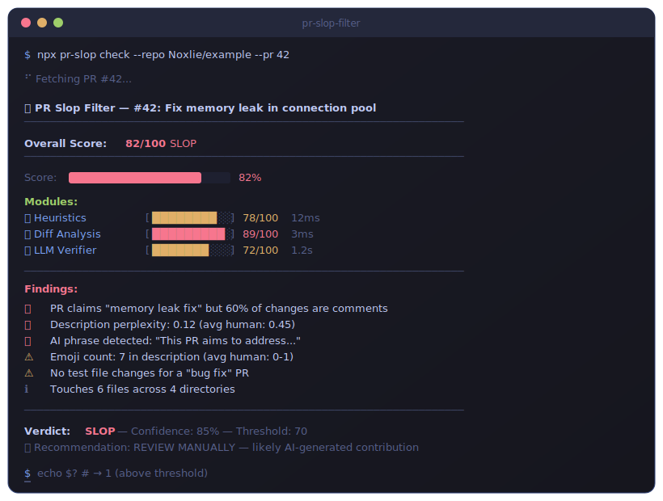

<div align="center">

# 🚫 **pr-slop-filter**

### _Stop AI slop PRs before they waste your time_

[](https://www.npmjs.com/package/pr-slop-filter)
[](https://github.com/noxlie/pr-slop-filter/actions)
[](LICENSE)
[](https://nodejs.org)

**The fastest way to detect and block AI-generated pull requests that waste maintainer time.**

[Quick Start](#-quick-start) · [CLI Usage](#-cli-usage) · [GitHub Action](#-github-action-usage) · [How It Works](#-how-it-works) · [Configuration](#-configuration)

</div>

<div align="center">



</div>

---

## 🔥 The Problem

**AI-generated PR slop is an epidemic.**

- **GitHub is considering a kill switch** for mass-generated contributions after repos reported hundreds of low-quality PRs flooding their issue trackers overnight.
- **The curl maintainer** publicly called out AI-generated "security fixes" that introduced more bugs than they fixed — wasting hours of review time.
- **Maintainer burnout** is accelerating as AI tools make it trivially easy to generate plausible-looking but fundamentally broken or useless PRs.
- **Signal-to-noise ratio** in open source is collapsing. When anyone can generate 100 PRs in an hour, the burden shifts entirely to maintainers.

> _"The PR was beautifully formatted, had perfect commit messages, and was completely wrong."_ — Every maintainer, 2024-2026

**pr-slop-filter** exists to restore the balance. It catches the tells that humans miss at a glance — and does it in milliseconds, not minutes.

---

## ⚡ Quick Start

Get running in **30 seconds**. Add this to `.github/workflows/pr-slop-check.yml`:

```yaml
name: PR Slop Check
on:
  pull_request:
    types: [opened, synchronize]

jobs:
  check:
    runs-on: ubuntu-latest
    steps:
      - uses: actions/checkout@v4
      - uses: noxlie/pr-slop-filter@v1
        with:
          threshold: 60
          fail-on-slop: true
```

**That's it.** Every PR will now be scanned. Slop gets blocked. Real contributions get through.

---

## 📦 Installation

```bash
# Global CLI
npm install -g pr-slop-filter

# Or use directly with npx
npx pr-slop-filter check

# As a project dependency
npm install --save-dev pr-slop-filter
```

---

## 🖥️ CLI Usage

### `check` — Analyze a PR

```bash
# Check a specific PR
pr-slop-filter check --pr 42

# Check the current branch against main
pr-slop-filter check --base main

# Check with a custom threshold
pr-slop-filter check --pr 100 --threshold 70
```

**Sample output:**
```
┌─────────────────────────────────────────────────────┐
│  pr-slop-filter v1.0.0                              │
│  Scanning PR #42: "Add comprehensive auth system"   │
├─────────────────────────────────────────────────────┤
│                                                     │
│  Heuristics      ████████░░░░░░░░  52/100           │
│  Diff Analysis   ████████████░░░░  75/100           │
│  LLM Verify      ██████████████░░  88/100           │
│                                                     │
│  ━━━━━━━━━━━━━━━━━━━━━━━━━━━━━━━━━━━━━━━━━━━━━━━━━ │
│  SLOP SCORE      ████████████░░░░  68/100           │
│  Verdict         ⚠️  BORDERLINE                     │
│                                                     │
│  Flags:                                             │
│  ⚠ High emoji density in commit messages            │
│  ⚠ Commit message perplexity below threshold        │
│  ✓ Diff matches PR description claims               │
│  ⚠ Missing test coverage for new code               │
│                                                     │
└─────────────────────────────────────────────────────┘
```

### `scan` — Bulk scan all open PRs

```bash
# Scan all open PRs
pr-slop-filter scan

# Scan with filters
pr-slop-filter scan --author "bot[bot]" --since 7d

# Export results
pr-slop-filter scan --format json --output results.json
```

**Sample output:**
```
┌───────────────────────────────────────────────────────────────┐
│  Bulk Scan: 23 open PRs                                       │
├───────┬─────────────────────────────────┬───────┬─────────────┤
│ PR    │ Title                           │ Score │ Verdict     │
├───────┼─────────────────────────────────┼───────┼─────────────┤
│ #142  │ Fix: comprehensive refactor...   │  92   │ 🚫 SLOP     │
│ #139  │ feat: add proper error handling  │  45   │ ✅ CLEAN     │
│ #137  │ Update README with new features  │  78   │ ⚠️ SUSPECT   │
│ #135  │ Fix typo in config.ts            │  12   │ ✅ CLEAN     │
│ #131  │ feat: implement auth system      │  85   │ 🚫 SLOP     │
├───────┴─────────────────────────────────┴───────┴─────────────┤
│  Summary: 15 clean · 4 suspect · 4 slop                       │
│  Estimated review time saved: 2.3 hours                       │
└───────────────────────────────────────────────────────────────┘
```

### `preflight` — Pre-submission check

Run this **before** you submit your PR to make sure it won't get flagged:

```bash
# Check your changes before opening a PR
pr-slop-filter preflight

# Check against a specific base
pr-slop-filter preflight --base develop
```

**Sample output:**
```
┌─────────────────────────────────────────────────────┐
│  Pre-flight Check                                    │
│  Branch: feat/new-api → main                         │
├─────────────────────────────────────────────────────┤
│                                                     │
│  Slop Score: 23/100                                 │
│  Status:     ✅ GOOD TO SUBMIT                      │
│                                                     │
│  ✓ Natural commit patterns detected                 │
│  ✓ Code diff aligns with description                │
│  ✓ Test coverage present                            │
│  ✓ No template phrases detected                     │
│                                                     │
└─────────────────────────────────────────────────────┘
```

---

## 🤖 GitHub Action Usage

Full configuration with all available inputs:

```yaml
name: PR Slop Filter
on:
  pull_request:
    types: [opened, synchronize, reopened]

permissions:
  contents: read
  pull-requests: write

jobs:
  slop-check:
    runs-on: ubuntu-latest
    steps:
      - uses: actions/checkout@v4

      - uses: noxlie/pr-slop-filter@v1
        with:
          # Slop score threshold (0-100). PRs above this are flagged.
          # Default: 60
          threshold: 60

          # Fail the check if slop is detected.
          # Default: true
          fail-on-slop: true

          # Detection engines to enable (comma-separated).
          # Options: heuristics,diff-analysis,llm-verify
          # Default: heuristics,diff-analysis
          engines: heuristics,diff-analysis

          # LLM provider for verification layer.
          # Options: openai, anthropic, local
          # Default: none (only used if llm-verify is in engines)
          llm-provider: openai

          # Output format for the action summary.
          # Options: text, json, github-annotation
          # Default: github-annotation
          output-format: github-annotation

          # GitHub token for PR access.
          # Default: ${{ github.token }}
          github-token: ${{ github.token }}

          # Post a comment on flagged PRs.
          # Default: false
          comment-on-slop: true

          # Custom message for slop comments.
          # Default: Auto-generated message
          slop-comment: "This PR shows signs of AI-generated content. Please review manually."

          # Paths to exclude from analysis (comma-separated glob).
          # Default: none
          exclude-paths: "*.md,docs/**,*.json"
```

### Action Outputs

```yaml
# Use outputs in subsequent steps
- uses: noxlie/pr-slop-filter@v1
  id: slop
- run: |
    echo "Score: ${{ steps.slop.outputs.score }}"
    echo "Verdict: ${{ steps.slop.outputs.verdict }}"
    echo "Flags: ${{ steps.slop.outputs.flags }}"
```

| Output | Description |
|--------|-------------|
| `score` | Slop score (0-100) |
| `verdict` | `clean`, `suspect`, or `slop` |
| `flags` | JSON array of detection flags |
| `details` | Full analysis breakdown |

---

## 🔬 How It Works

**Three layers. Zero guesswork.**

```
                        PR Submitted
                             │
                             ▼
              ┌─────────────────────────────┐
              │      Layer 1: Heuristics    │  ◄── Fast (< 10ms)
              │                             │
              │  • Perplexity analysis      │
              │  • AI phrase detection       │
              │  • Emoji density check       │
              │  • Commit message patterns   │
              │  • Formatting anomalies      │
              └──────────────┬──────────────┘
                             │
                             ▼
              ┌─────────────────────────────┐
              │    Layer 2: Diff Analysis    │  ◄── Thorough (< 100ms)
              │                             │
              │  • Claim vs reality check    │
              │  • Unrelated file detection  │
              │  • Comment-to-code ratio     │
              │  • Missing test detection    │
              │  • Style-only change filter  │
              └──────────────┬──────────────┘
                             │
                             ▼
              ┌─────────────────────────────┐
              │   Layer 3: LLM Verification  │  ◄── Optional (< 2s)
              │                             │
              │  • Semantic code review      │
              │  • Intent vs implementation  │
              │  • Cross-file coherence      │
              │  • Common AI mistake patterns│
              └──────────────┬──────────────┘
                             │
                             ▼
                    ┌─────────────────┐
                    │   Slop Score    │
                    │    0 ─── 100    │
                    └─────────────────┘
```

**Each layer is independently weighted and can be enabled/disabled.** Layers are evaluated in order — if Layer 1 flags a PR as high-confidence slop, Layers 2 and 3 can optionally be skipped for speed.

---

## 📊 Detection Breakdown

| Module | Layer | What It Checks | Weight |
|--------|-------|----------------|--------|
| **Perplexity Analysis** | Heuristics | Text randomness — AI text has suspiciously uniform perplexity | 15% |
| **AI Phrase Detection** | Heuristics | Known AI phrases: "comprehensive", "robust", "leverage", "streamline" | 12% |
| **Emoji Density** | Heuristics | Excessive emoji in commits/PR body (🤖 pattern) | 8% |
| **Commit Patterns** | Heuristics | Perfect conventional commits with no typos — too clean to be human | 10% |
| **Formatting Anomalies** | Heuristics | Over-structured markdown, excessive bullet points, template feel | 7% |
| **Claim vs Reality** | Diff Analysis | Does the code actually implement what the PR description claims? | 15% |
| **Unrelated Files** | Diff Analysis | Files changed that have nothing to do with the stated purpose | 10% |
| **Comment-to-Code Ratio** | Diff Analysis | Excessive inline comments explaining obvious code | 8% |
| **Missing Tests** | Diff Analysis | New code without corresponding test coverage | 8% |
| **Style-Only Changes** | Diff Analysis | Formatting/whitespace changes that add no value | 7% |
| **Semantic Review** | LLM Verify | Does the code make logical sense in context? | 10% |
| **Intent Matching** | LLM Verify | Does implementation match stated intent? | 10% |
| **AI Mistake Patterns** | LLM Verify | Common AI errors: hallucinated APIs, impossible logic | 10% |

---

## 🏆 Comparison

| Feature | **pr-slop-filter** | SlopGuard | pr-slop-stopper | Manual Review |
|---------|:------------------:|:---------:|:---------------:|:-------------:|
| **Stars** | ⭐ New | ⭐⭐⭐⭐⭐ 50 | ⭐⭐⭐ 30 | — |
| **Heuristic Detection** | ✅ Advanced | ✅ Basic regex | ✅ Basic | 👀 Human |
| **Diff Analysis** | ✅ Full | ❌ | ❌ | 👀 Human |
| **LLM Verification** | ✅ Optional | ❌ | ❌ | 👀 Human |
| **CLI Tool** | ✅ Full CLI | ❌ | ❌ | — |
| **Bulk Scanning** | ✅ All open PRs | ❌ | ❌ | — |
| **Pre-flight Check** | ✅ Before submit | ❌ | ❌ | — |
| **Multiple Output Formats** | ✅ 3 formats | ⚠️ JSON only | ⚠️ Text only | — |
| **Configurable Thresholds** | ✅ Granular | ⚠️ Binary | ⚠️ Binary | — |
| **Speed** | 🚀 < 50ms | 🚀 < 20ms | 🚀 < 20ms | 🐌 Minutes |
| **Accuracy** | 🎯 High | ⚠️ Medium | ⚠️ Medium | 🎯 High |
| **Scalability** | ♾️ Infinite | ♾️ Infinite | ♾️ Infinite | 📈 Linear |
| **Cost** | Free + optional LLM | Free | Free | 💰 Expensive |

**Why pr-slop-filter?** Other tools only do regex matching on PR bodies. We analyze the actual diff, detect mismatched claims, and optionally verify with LLMs. It's the difference between a spam filter and a code reviewer.

---

## ⚙️ Configuration

### Environment Variables

| Variable | Description | Default |
|----------|-------------|---------|
| `SLOP_THRESHOLD` | Score threshold for flagging (0-100) | `60` |
| `SLOP_ENGINES` | Comma-separated list of engines to enable | `heuristics,diff-analysis` |
| `SLOP_LLM_PROVIDER` | LLM provider: `openai`, `anthropic`, `local` | _(disabled)_ |
| `SLOP_LLM_MODEL` | Model to use for LLM verification | `gpt-4o-mini` |
| `SLOP_LLM_ENDPOINT` | Custom endpoint for local LLM | `http://localhost:11434` |
| `SLOP_OUTPUT` | Output format: `text`, `json`, `github-annotation` | `text` |
| `SLOP_COMMENT` | Post comment on flagged PRs (`true`/`false`) | `false` |
| `SLOP_EXCLUDE` | Glob patterns to exclude (comma-separated) | _(none)_ |
| `OPENAI_API_KEY` | OpenAI API key (for LLM verification) | _(none)_ |
| `ANTHROPIC_API_KEY` | Anthropic API key (for LLM verification) | _(none)_ |
| `GITHUB_TOKEN` | GitHub token for PR access | _(auto)_ |

### CLI Flags

```bash
pr-slop-filter check \
  --pr <number>              # PR number to check
  --base <branch>            # Base branch for comparison
  --threshold <0-100>        # Slop score threshold
  --engines <list>           # Engines to enable
  --output <format>          # Output format
  --json                     # Shorthand for --output json
  --verbose                  # Show detailed analysis
  --no-color                 # Disable colored output
  --exclude <globs>          # Exclude paths (comma-separated)
```

### Config File

Create `.sloprc.json` or `.sloprc.yml` in your project root:

```json
{
  "threshold": 60,
  "engines": ["heuristics", "diff-analysis", "llm-verify"],
  "llm": {
    "provider": "openai",
    "model": "gpt-4o-mini"
  },
  "exclude": ["*.md", "docs/**", "*.json", "*.lock"],
  "output": "text",
  "comment": false
}
```

---

## 📄 Output Formats

### Text (Pretty)

The default. Colorized, box-drawn output with score bars and verdicts.

### JSON (Machine)

```json
{
  "pr": 42,
  "title": "Add comprehensive auth system",
  "score": 68,
  "verdict": "suspect",
  "engines": {
    "heuristics": {
      "score": 52,
      "flags": [
        { "type": "emoji_density", "severity": "warning", "detail": "3.2 emoji per commit" },
        { "type": "low_perplexity", "severity": "warning", "detail": "Avg perplexity: 12.3" }
      ]
    },
    "diff_analysis": {
      "score": 75,
      "flags": [
        { "type": "missing_tests", "severity": "warning", "detail": "8 new functions, 0 tests" }
      ]
    }
  },
  "summary": "PR shows signs of AI generation. Commit patterns and code style suggest automated content.",
  "analyzed_at": "2026-01-15T10:30:00Z",
  "duration_ms": 47
}
```

### GitHub Annotation (CI)

Output as GitHub Actions annotations for inline PR feedback:

```
::warning file=src/auth.ts::pr-slop-filter: Missing test coverage for new authentication module
::warning file=commit::pr-slop-filter: Suspiciously uniform commit message structure
::notice file=PR::pr-slop-filter: Slop score 68/100 — borderline (threshold: 60)
```

---

## 🤝 Contributing

We love contributions! See [CONTRIBUTING.md](CONTRIBUTING.md) for:

- Development setup
- How to add new detectors
- Commit conventions
- PR guidelines

```bash
git clone https://github.com/noxlie/pr-slop-filter.git
cd pr-slop-filter
npm install
npm test
```

---

## 📜 License

[MIT](LICENSE) — use it however you want.

---

<div align="center">

**Built with ❤️ by [Noxlie](https://github.com/noxlie)**

_If this saved you from reviewing one more slop PR, give it a ⭐_

</div>
